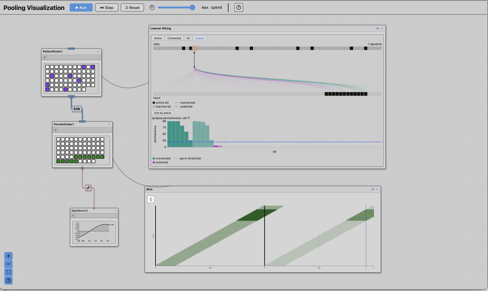

# DCC Published Assets

Published assets for **Discrete Cortical Circuits (DCC)** — interactive web apps, encoder visualizers, and static infographics — served from GitHub Pages at `https://jacobeverist.github.io/dcc-public/`.

## DCC Studio — Pooling Network Demo

### ▶ [Launch the demo](https://jacobeverist.github.io/dcc-public/standalone_pooling_demo_v1/)

A fully interactive, configurable, inspectable demonstration of a classic HTM-like **pooling network**, running entirely in your browser. See the [announcement post](https://corticalcircuits.com/posts/dcc-studio-demo/) for the story behind it.

The core algorithms are Rust, compiled to WebAssembly. The algorithm is very efficient and runs at high speed in a browser's single-threaded environment.  It was designed to scale.

### The network

Three **nodes**, wired in sequence:

**`SignalSource1`** → **`PeriodicScalar1`** → **`PatternPooler1`**

- **Data source** — a scalar signal. The shipped network runs a slow sine wave.
- **Encoder** — the **Grid: Fixed-Weight** encoder, 64 bins with a weight of 12, turning each scalar value into a **sparse code** (an SDR).
- **Pooler** — a **Pattern Pooler** with 64 cells, 8 of which activate on any given step.

Every node carries its own visualizations, so you can watch the data as it is produced, encoded into a sparse code, and then processed by the pooler cells — accumulating synaptic input, selecting winners, and learning by changing their **synaptic permanences**.

Run it with the toolbar: **Run**, **Step**, **Reset**, and a speed slider. It starts running with learning on.

### Inspecting

Two inspection views are attached to the network, and both are live while it runs:

- **Learner Wiring** (on the pooler) — the whole cell population across the top, the input bits across the bottom, and the dendrite of whichever cell you select fanned out between them, showing which synapses are *connected* and which are merely *potential*. Below it, that cell's synapse permanences are plotted against the permanence threshold. Click any cell to inspect it.
- **Bins** (on the encoder) — the encoder read as a set of receptive fields across its input range, which is the most direct way to see what "grid-like" actually means here.

### Configuring

Each of the three nodes has a configure button that opens an editor built for that node, with real-time visual feedback as you turn the knobs. This is the fastest way to build an intuition for how a parameter changes the behavior.

**Pattern Pooler** — the pooler algorithm here is the *DCCcore variant*, which is similar to the BrainBlocks Pattern Pooler. Each cell has a single dendrite with a fixed receptive field; the cells with the highest overlap win (k-winner-take-all), and only the winners learn. You can change:

- **cells** — the size of the cell population, and so the width of the output
- **weight** — how many cells activate per step
- **permanence threshold** — the permanence at which a synapse counts as connected
- **permanence increment** / **permanence decrement** — how fast a synapse strengthens or weakens during learning
- **pooling %** — how much of the input a cell's dendrite is wired to
- **connectivity %** — how many of those synapses start out already connected
- **learning %** — what fraction of a winning cell's synapses update on a learning step

**Grid: Fixed-Weight encoder** — a uniform arrangement of 1D grid cells whose receptive fields repeat, and which always emit the same number of active bits. It is worth understanding as a periodic encoder: firing fields that wrap, rather than one field per place. You can change **n** (the number of bins), the **weight** (active bits per code), the **modulus** (the period at which the grid cells repeat their activation to scalar input), and the **lower** and **upper bounds** of the encoded range — alongside several ways to visualize and characterize what the encoder is doing.

**Data source** — fine-grained control over the scalar signal, working much like a soundtrack or video editor. You arrange **clips** (sine, square, sawtooth, each with its own amplitude, frequency, phase, and offset) along a **track**, and combine overlapping clips with a **transition** — forward precedence, backward precedence, blend, or jitter. Multiple tracks let you build independent waveforms that sum into one complex signal: a baseline track, plus anomaly tracks layered on top. Over that you can apply **data mutations** — noise, bias, scale, clamp, and dropout — and **time mutations** — a stall, where the signal freezes and then resumes. These are the artifacts real sensors produce: dropouts, update stalls, clamped ranges.

### Status and feedback

This is a beta. You are among the first people to use it, and feedback is genuinely wanted — if you hit an error, find something confusing, or want something to work differently, please [open a GitHub issue](https://github.com/jacobeverist/dcc-public/issues).

Probably the first question is: *can I build my own circuits?* Yes, that capability exists. No, not in this version. It will be published when it is ready.

In the meantime, this standalone demo should keep you busy. It can be quite fun to see the things you have only imagined while thinking about these algorithms.

## Other published assets

Earlier simulators, the encoder visualizers, the encoder diagram gallery, and instructions for embedding any of them in a page or forum are catalogued in **[APPS.md](APPS.md)**. Those apps remain published at their existing URLs.

## Technologies

- **Rust + WebAssembly** — the DCC engine, compiled to run in the browser
- **React** — UI framework
- **React Flow** — network graph visualization
- **Vite** — build tooling

Everything in this repository is a pre-built artifact; the source lives elsewhere.

## Terms

Free to use and embed for research, teaching, evaluation and personal projects. Commercial use needs a separate licence. Everything runs in your browser — there is no server — and anything you build with it is yours.

The full terms are in **[TERMS.md](TERMS.md)**.
