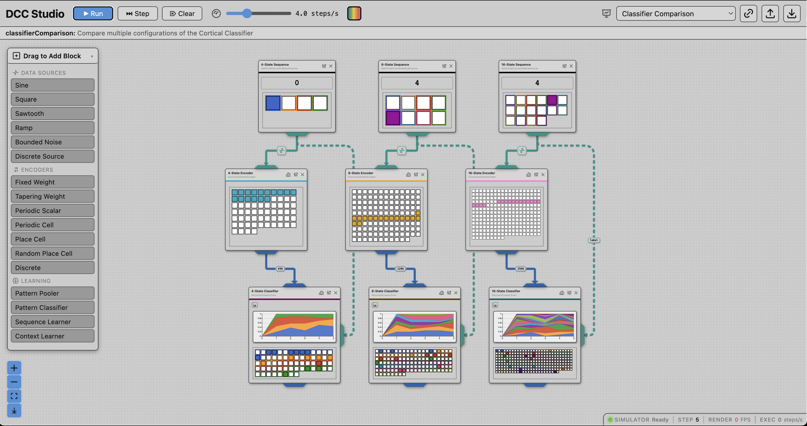

# DCC Published Assets

This repository hosts published assets for Discrete Cortical Networks (DCC) research:

- **Web-Based Apps** — interactive simulations and visualizations
- **Visuals** — plots, animations, illustrations, and infographics

Everything is served as static files via GitHub Pages at `https://jacobeverist.github.io/dcc-public/`. Each top-level directory is a self-contained, independently hosted app (its own HTML, JavaScript, CSS, and — where applicable — a Rust-compiled WebAssembly engine). Versions are kept side-by-side (`_v1`, `_v2`, `_v3`) so existing embed links keep working; the latest of each is the recommended entry point.

## Published Apps

### DCC Simulations

Interactive simulations of DCC neural-network demos, powered by a Rust→WebAssembly engine with a React + React Flow visualization. Embeddable in websites, documentation, and forums.





- [DCC Studio](https://jacobeverist.github.io/dcc-public/dcc_studio_v1) — latest DCC studio app
- [DCC Dashboard (v2)](https://jacobeverist.github.io/dcc-public/embedded_dcc_viewer_v2) — full dashboard to load and run many demos
- [Encoder Comparison (v2 embed)](https://jacobeverist.github.io/dcc-public/embedded_dcc_viewer_v2/embed.html?demo=encoderComparison) — single demo, embeddable
- [Simple Scalar Encoder (v1 embed)](https://jacobeverist.github.io/dcc-public/embedded_dcc_viewer_v1/embed.html?demo=simpleEncoder) — original basic encoder demo

**Features:** WebAssembly-powered simulation, interactive controls (play, pause, step, speed, learning toggle), real-time visualization of network state / time-series / bit fields, and iframe embedding.

### Encoder Visualizers

Tools to configure scalar encoders and interactively inspect their encodings.


- [Encoder Studio](https://jacobeverist.github.io/dcc-public/encoder_studio_v1) — latest studio with a configurable, embeddable layout
- [Encoder Analysis v3](https://jacobeverist.github.io/dcc-public/encoder_analysis_v3) — adds an [embed builder](https://jacobeverist.github.io/dcc-public/encoder_analysis_v3/embed-builder.html) and [playground](https://jacobeverist.github.io/dcc-public/encoder_analysis_v3/playground.html)
- [Encoder Analysis v2](https://jacobeverist.github.io/dcc-public/encoder_analysis_v2) — previous version
- [Encoder Analysis v1](https://jacobeverist.github.io/dcc-public/encoder_analysis_v1) — original version

### Infographics


- [Encoder Diagram Gallery](https://jacobeverist.github.io/dcc-public/encoder_infographics_v1) — static gallery of encoder diagrams (paired SVG + JSON spec per diagram)

## Technologies

- **React** — UI framework
- **React Flow** — graph visualization
- **Rust + WebAssembly** — core DCC simulation engine, compiled to run in the browser
- **Vite** — build tooling (apps here are pre-built artifacts)

## Embedding

Embed any viewer with an iframe. Simulator demos are selected with a `?demo=` query parameter:

```html
<iframe
    src="https://jacobeverist.github.io/dcc-public/embedded_dcc_viewer_v2/embed.html?demo=encoderComparison"
    title="DCC Network Viewer"
    allow="wasm-eval"
    width="850"
    height="600">
</iframe>
```

`allow="wasm-eval"` is required for WebAssembly execution. Encoder Studio supports a configurable embed layout; the easiest way to generate embed code for the encoder tools is the [Encoder Analysis v3 embed builder](https://jacobeverist.github.io/dcc-public/encoder_analysis_v3/embed-builder.html).

### Discourse Integration

To embed in Discourse forums:
1. Navigate to: Admin Settings → Site Settings → "allowed iframes"
2. Add `https://jacobeverist.github.io/dcc-public/` to the allowed iframes list
3. Paste the iframe code into your post
