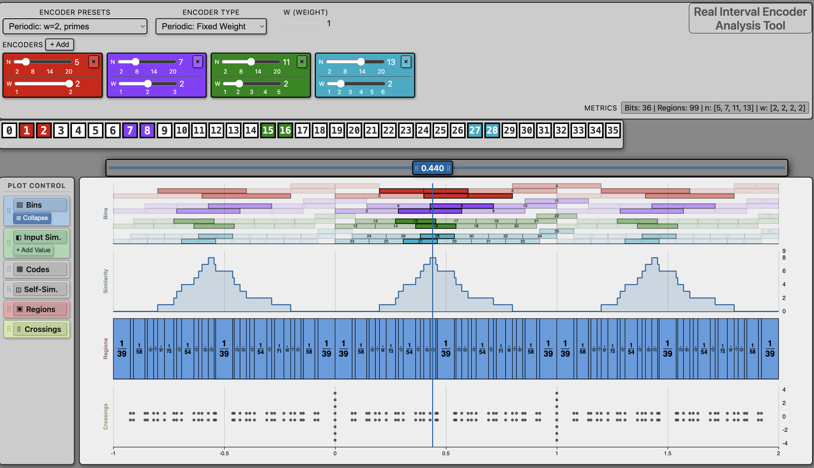

# Encoder Analysis Dashboard

A tool to configure encoders and interactively visualize their encodings in different ways.

[Encoder Analysis Dashboard](https://jacobeverist.github.io/dcc-public/encoder_analysis_v2)

